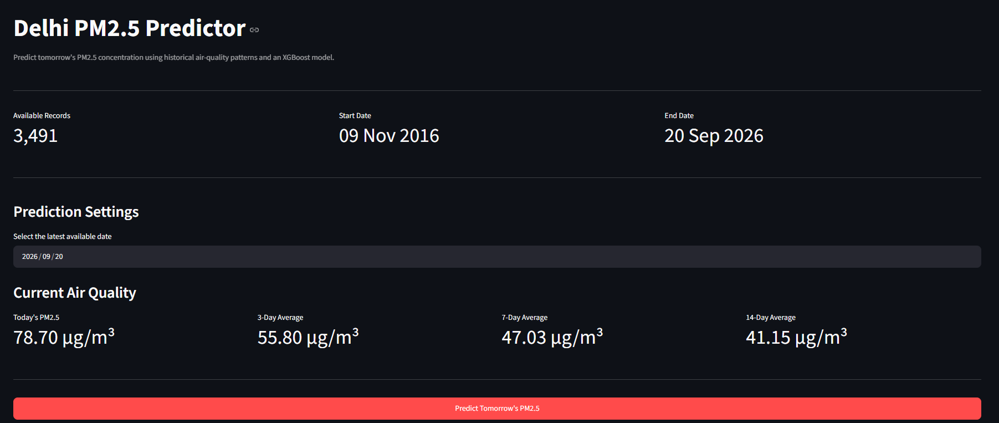
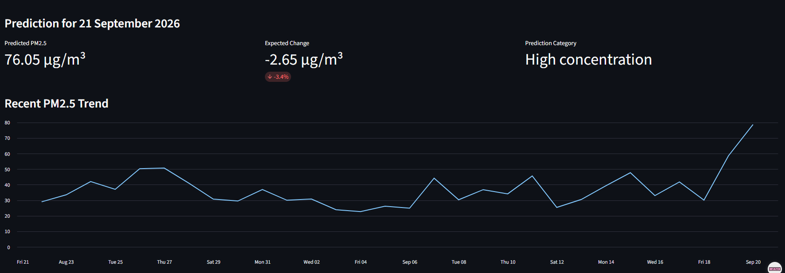

# Delhi PM2.5 Prediction

A machine learning project that predicts **next-day PM2.5 concentration in New Delhi** using historical air-quality measurements and time-series features.

The project covers the complete machine learning workflow, from real-world data collection and exploratory analysis to feature engineering, model comparison, XGBoost training, and deployment through an interactive Streamlit application.

## Live Demo

**Streamlit App:**
https://air-quality-predictor-wkrbun2tdpmeeqvvfsc6gh.streamlit.app/

**GitHub Repository:**
https://github.com/ayushi-stacks/Air-quality-predictor

---

## Project Overview

Air pollution is a major environmental challenge in urban areas, with PM2.5 being one of the most important pollutants to monitor because of its ability to penetrate deep into the respiratory system.

This project uses historical PM2.5 measurements from **New Delhi** to build a regression model capable of estimating the PM2.5 concentration for the following day.

Rather than predicting an official AQI value, the model directly predicts **PM2.5 concentration in µg/m³**.

The final model is deployed as a Streamlit web application where users can select a historical date and generate a prediction for the following day.

---

## Objectives

The main objectives of this project are:

* Collect real-world PM2.5 data from the OpenAQ API
* Clean and preprocess the collected data
* Perform exploratory data analysis
* Analyze pollution trends and distributions
* Engineer time-series features from historical measurements
* Build multiple regression models
* Compare model performance using standard regression metrics
* Select XGBoost as the final prediction model
* Build an interactive Streamlit application
* Deploy the application publicly
* Practice an end-to-end machine learning workflow

---

## Dataset

### Data Source

**OpenAQ**

The project uses publicly available air-quality measurements collected through the OpenAQ platform.

The dataset contains historical PM2.5 measurements for a monitoring location in **New Delhi, India**.

### Target Variable

The target variable is:

```text
Next-day PM2.5 concentration
```

measured in:

```text
µg/m³
```

### Data Pipeline

The data was collected through the OpenAQ API rather than using a pre-packaged Kaggle dataset.

The workflow was:

```text
OpenAQ API
     ↓
PM2.5 Measurements
     ↓
Data Cleaning
     ↓
Daily PM2.5 Dataset
     ↓
Feature Engineering
     ↓
Machine Learning Dataset
```

---

## Tech Stack

### Programming

* Python

### Data Analysis

* Pandas
* NumPy
* Jupyter Notebook

### Data Visualization

* Matplotlib
* Seaborn

### Machine Learning

* Scikit-learn
* XGBoost

### Model Persistence

* Joblib

### Deployment

* Streamlit

### Data Collection

* OpenAQ API
* Requests

### Version Control

* Git
* GitHub

---

## Project Structure

```text
Air-quality-predictor/
│
├── app/
│   └── app.py
│
├── data/
│   ├── delhi_pm25_daily.csv
│   └── delhi_pm25_model_data.csv
│
├── models/
│   └── xgboost_pm25_model.pkl
│
├── notebooks/
│   └── air_quality_analysis.ipynb
│
├── src/
│   ├── download_data.py
│   ├── preprocessing.py
│   ├── features.py
│   ├── train.py
│   └── predict.py
│
├── visuals/
│   ├── app-dashboard.png
│   └── prediction-result.png
│
├── .gitignore
├── README.md
└── requirements.txt
```

---

## Workflow

The project follows an end-to-end machine learning pipeline:

```text
Data Collection
      ↓
Data Cleaning
      ↓
Exploratory Data Analysis
      ↓
Feature Engineering
      ↓
Train/Test Split
      ↓
Model Training
      ↓
Model Evaluation
      ↓
XGBoost Model Selection
      ↓
Model Serialization
      ↓
Streamlit Application
      ↓
Deployment
```

---

# 1. Data Collection

PM2.5 measurements were collected using the OpenAQ API.

The project uses an OpenAQ sensor associated with the selected New Delhi monitoring location.

The downloaded data was processed into a daily dataset containing:

```text
date
pm25
```

The resulting dataset is stored in:

```text
data/delhi_pm25_daily.csv
```

The data collection script is located at:

```text
src/download_data.py
```

The script handles API requests, pagination, sorting, and duplicate removal before saving the final dataset.

---

# 2. Data Preprocessing

The collected data was cleaned and prepared for analysis.

The preprocessing workflow includes:

* Converting timestamps into datetime format
* Handling timezone information
* Sorting observations chronologically
* Removing duplicate records
* Checking missing values
* Checking invalid or negative PM2.5 measurements
* Preparing the dataset for time-series feature engineering

The processed data is then used for exploratory analysis and model development.

---

# 3. Exploratory Data Analysis

Exploratory Data Analysis was performed to understand the behavior of PM2.5 over time.

The analysis includes:

### Dataset Inspection

* Number of observations
* Data types
* Missing values
* Duplicate records
* Descriptive statistics

### Pollution Distribution

The distribution of PM2.5 measurements was analyzed to understand:

* Central tendency
* Spread
* Skewness
* Extreme pollution values

### Daily Pollution Trend

A time-series visualization was created to observe changes in PM2.5 concentration over time.

### Rolling Averages

Rolling averages were used to smooth short-term fluctuations and identify longer-term pollution patterns.

The project uses:

```text
3-day rolling average
7-day rolling average
14-day rolling average
```

### Extreme Pollution Days

The highest recorded PM2.5 values were also examined to identify particularly polluted periods.

---

# 4. Feature Engineering

The prediction task is formulated as:

```text
Historical PM2.5
        ↓
Prediction Model
        ↓
Next-Day PM2.5
```

The target variable is created by shifting the PM2.5 series by one day:

```python
target_pm25 = pm25.shift(-1)
```

The model uses historical pollution values and temporal information as predictors.

### Lag Features

The following lag features are used:

```text
lag_1
lag_2
lag_3
lag_7
```

These represent previous PM2.5 observations.

### Rolling Features

The model also uses:

```text
rolling_3
rolling_7
rolling_14
```

These represent rolling averages over different time windows.

### Calendar Features

Temporal features include:

```text
day_of_week
day_of_year
week_of_year
```

These allow the model to capture recurring temporal patterns.

### Final Feature Set

```python
features = [
    "lag_1",
    "lag_2",
    "lag_3",
    "lag_7",
    "rolling_3",
    "rolling_7",
    "rolling_14",
    "day_of_week",
    "day_of_year",
    "week_of_year"
]
```

---

# 5. Train/Test Split

Because this is a time-dependent prediction problem, the dataset was split chronologically rather than randomly.

```text
Historical Data
────────────────────────────────────
80% Training              20% Testing
────────────────────────────────────
Past                       Future
```

This approach prevents future observations from being randomly mixed into the training data.

The model is therefore evaluated on a later period that was not used during training.

---

# 6. Machine Learning Models

Three regression models were trained and compared.

## Linear Regression

Linear Regression was used as a baseline model.

It provides a simple reference point for evaluating whether more complex models improve predictive performance.

## Random Forest Regressor

Random Forest was used to capture nonlinear relationships between historical PM2.5 patterns and future concentration.

Configuration:

```python
RandomForestRegressor(
    n_estimators=200,
    max_depth=15,
    random_state=42,
    n_jobs=-1
)
```

## XGBoost Regressor

XGBoost was used as the final machine learning model because of its ability to model complex nonlinear relationships and interactions between features.

Configuration:

```python
XGBRegressor(
    n_estimators=300,
    learning_rate=0.05,
    max_depth=6,
    subsample=0.8,
    colsample_bytree=0.8,
    objective="reg:squarederror",
    random_state=42
)
```

---

# 7. Model Evaluation

The models were evaluated using three regression metrics:

* **Mean Absolute Error (MAE)**
* **Root Mean Squared Error (RMSE)**
* **R² Score**

### Model Comparison

| Model             |     MAE |    RMSE |     R² |
| ----------------- | ------: | ------: | -----: |
| Linear Regression | 20.3413 | 30.3948 | 0.8141 |
| Random Forest     | 22.1681 | 36.7489 | 0.7282 |
| XGBoost           | 22.1360 | 36.0829 | 0.7380 |

### Results

Linear Regression achieved the lowest MAE and RMSE and the highest R² score on the held-out test set.

XGBoost achieved an R² of **0.7380**, with an MAE of **22.1360 µg/m³** and RMSE of **36.0829 µg/m³**.

Although Linear Regression performed better on this dataset, **XGBoost was retained as the deployed model** to provide a nonlinear ensemble-based approach and to support further experimentation and feature expansion.

### XGBoost Feature Importance

The most influential features in the XGBoost model were:

| Feature      | Importance |
| ------------ | ---------: |
| rolling_3    |     0.2928 |
| rolling_7    |     0.1479 |
| day_of_year  |     0.1043 |
| lag_3        |     0.1001 |
| lag_1        |     0.0785 |
| rolling_14   |     0.0698 |
| lag_2        |     0.0629 |
| week_of_year |     0.0611 |
| lag_7        |     0.0589 |
| day_of_week  |     0.0237 |

The **3-day rolling average** was the most important feature for the XGBoost model, followed by the 7-day rolling average. This indicates that recent PM2.5 trends contributed substantially to the model's predictions.

## Mean Absolute Error

MAE measures the average absolute difference between actual and predicted PM2.5 values.

```text
MAE = average(|actual - predicted|)
```

Lower MAE indicates smaller average prediction errors.

## Root Mean Squared Error

RMSE gives greater weight to larger prediction errors.

```text
RMSE = √(average((actual - predicted)²))
```

Lower RMSE indicates better predictive performance.

## R² Score

R² measures how much of the variation in the target variable is explained by the model.

A higher R² generally indicates better fit to the test data.

### Model Comparison

| Model             |       MAE |      RMSE |        R² |
| ----------------- | --------: | --------: | --------: |
| Linear Regression | Add score | Add score | Add score |
| Random Forest     | Add score | Add score | Add score |
| XGBoost           | Add score | Add score | Add score |

> Replace the values above with the actual results generated by `train.py`.

The XGBoost model was selected as the final model used by the Streamlit application.

---

# 8. Actual vs Predicted Analysis

The trained XGBoost model was evaluated by comparing its predictions against the actual PM2.5 values in the test set.

The comparison helps determine how closely the model follows the actual pollution trend.

The project also visualizes:

```text
Actual PM2.5
vs.
Predicted PM2.5
```

This provides a visual understanding of model performance beyond numerical evaluation metrics.

---

# 9. Feature Importance

XGBoost feature importance was also analyzed to understand which variables contributed most to the model's predictions.

The feature importance analysis helps identify the relative contribution of:

* Recent PM2.5 measurements
* Short-term rolling averages
* Longer-term rolling averages
* Calendar features

This provides some interpretability into how historical pollution patterns influence the next-day prediction.

---

# 10. Model Serialization

The trained XGBoost model is saved using Joblib:

```text
models/xgboost_pm25_model.pkl
```

This allows the Streamlit application to load the trained model without retraining it every time the application starts.

---

# 11. Streamlit Application

The final model is integrated into an interactive Streamlit application.

The application is located at:

```text
app/app.py
```

The application provides a simple interface for generating next-day PM2.5 predictions.

### Application Features

The dashboard displays:

* Number of available records
* Dataset start date
* Dataset end date
* Current PM2.5 concentration
* 3-day average
* 7-day average
* 14-day average
* Predicted next-day PM2.5
* Expected change from the current PM2.5 value
* Prediction category
* Recent 30-day PM2.5 trend

---

# 12. Prediction Interface

The user can select the latest historical date available in the dataset.

The application automatically calculates the required features from historical observations.

The user then clicks:

```text
Predict Tomorrow's PM2.5
```

The trained XGBoost model generates the prediction.

The application displays:

```text
Predicted PM2.5
Expected Change
Prediction Category
```

along with a recent PM2.5 trend chart.

---

# 13. Prediction Categories

The application provides a simple descriptive category based on predicted PM2.5 concentration:

| Predicted PM2.5 | Category                |
| --------------: | ----------------------- |
|      < 30 µg/m³ | Lower concentration     |
|  30–59.99 µg/m³ | Moderate concentration  |
|  60–89.99 µg/m³ | High concentration      |
|      ≥ 90 µg/m³ | Very high concentration |

These labels are intended as simple concentration categories for the application and are **not official AQI classifications**.

---

# 14. Application Screenshots

### Dashboard



### Prediction Result



---

# 15. Key Insights

The project demonstrates several important aspects of PM2.5 prediction:

* Historical PM2.5 measurements contain useful information for predicting future concentration.
* Recent pollution measurements can be transformed into lag and rolling features.
* Time-based features can provide additional temporal information to machine learning models.
* Different regression algorithms can produce substantially different predictive performance.
* XGBoost can model nonlinear relationships between historical pollution patterns and future PM2.5 concentration.
* A trained machine learning model can be integrated into a simple interactive application using Streamlit.

---

# 16. Limitations

This project has several limitations.

### Limited Predictive Variables

The current model primarily relies on historical PM2.5 measurements and calendar features.

It does not currently incorporate other potentially important variables such as:

* Temperature
* Humidity
* Wind speed
* Wind direction
* Atmospheric pressure
* Rainfall
* Traffic activity
* Industrial emissions
* Satellite observations

Including these variables could provide additional information for prediction.

### Single Monitoring Location

The model is based on measurements from a selected New Delhi monitoring location.

Therefore, the model should not automatically be interpreted as representing pollution across the entire Delhi metropolitan region.

### Missing Calendar Dates

The source data may contain gaps in observations.

The current lag features are based on previous available observations, meaning a previous row does not necessarily represent a consecutive calendar day.

This is an important limitation of the current implementation.

### No Official AQI Prediction

The model predicts PM2.5 concentration directly.

It does not calculate or predict the official AQI issued by a government authority.

### Short-Term Forecasting

The application is designed for next-day prediction.

It is not intended to provide long-term pollution forecasting.

---

# 17. Future Improvements

Potential improvements include:

* Handle missing calendar dates explicitly
* Add meteorological variables
* Add multiple monitoring stations
* Build a Delhi-wide pollution model
* Experiment with LightGBM and other boosting algorithms
* Perform hyperparameter optimization
* Add cross-validation designed for time-series data
* Add prediction intervals or uncertainty estimates
* Build multi-day forecasting
* Add automated data updates
* Add model monitoring
* Add automated retraining
* Improve deployment infrastructure
* Add an interactive historical pollution map
* Add station-level comparisons
* Integrate real-time OpenAQ measurements

---

# 18. How to Run Locally

Clone the repository:

```bash
git clone https://github.com/ayushi-stacks/Air-quality-predictor.git
```

Move into the project directory:

```bash
cd Air-quality-predictor
```

Create a virtual environment:

```bash
python -m venv .venv
```

Activate it on Windows:

```powershell
.venv\Scripts\Activate.ps1
```

Install the dependencies:

```bash
pip install -r requirements.txt
```

Run the Streamlit application:

```bash
streamlit run app/app.py
```

The application will open in your browser.

---

# 19. Data Collection

To collect new data through the OpenAQ API, an OpenAQ API key is required.

Set the API key as an environment variable rather than placing it directly inside the source code.

Windows PowerShell:

```powershell
$env:OPENAQ_API_KEY="YOUR_API_KEY"
```

Then run:

```bash
python src/download_data.py
```

The API key should never be committed to GitHub.

---

# 20. Model Training

The machine learning pipeline can be executed using the training script:

```bash
python src/train.py
```

The training process:

```text
Load processed data
       ↓
Select features
       ↓
Chronological train/test split
       ↓
Train Linear Regression
       ↓
Train Random Forest
       ↓
Train XGBoost
       ↓
Evaluate models
       ↓
Generate comparison
       ↓
Save XGBoost model
```

The trained model is saved to:

```text
models/xgboost_pm25_model.pkl
```

---

# 21. Requirements

The main dependencies are:

```text
pandas
numpy
matplotlib
seaborn
scikit-learn
xgboost
streamlit
joblib
requests
```

They are listed in:

```text
requirements.txt
```

---

# 22. Skills Demonstrated

This project demonstrates practical experience with:

### Data Engineering

* REST API data collection
* Pagination
* Data cleaning
* Datetime processing
* Time-series preprocessing

### Data Analysis

* Pandas
* NumPy
* Statistical analysis
* Exploratory Data Analysis

### Data Visualization

* Matplotlib
* Seaborn
* Time-series visualization
* Distribution analysis
* Rolling averages

### Machine Learning

* Regression
* Feature engineering
* Time-series train/test splitting
* Model comparison
* Model evaluation
* XGBoost
* Feature importance

### Deployment

* Streamlit
* Model serialization
* GitHub
* Streamlit Community Cloud

---

# 23. What I Learned

Through this project, I practiced the complete lifecycle of a machine learning project rather than only training a model.

The major learning areas included:

* Working with real-world API data
* Cleaning time-dependent datasets
* Designing features for forecasting
* Avoiding random train/test splits for temporal data
* Comparing baseline and ensemble models
* Evaluating regression models using multiple metrics
* Saving and loading trained models
* Building an interactive ML application
* Deploying a machine learning project publicly
* Structuring a project for reproducibility

---

# 24. Project Outcome

This project resulted in a complete machine learning application that:

```text
Collects real-world data
        ↓
Processes historical PM2.5 measurements
        ↓
Performs exploratory analysis
        ↓
Creates forecasting features
        ↓
Trains multiple ML models
        ↓
Evaluates model performance
        ↓
Uses XGBoost for prediction
        ↓
Provides predictions through Streamlit
        ↓
Runs as a publicly accessible web application
```

The project therefore demonstrates the transition from **raw real-world data to a deployed machine learning application**.

---

## Author

**Ayushi Mandal**

---

## License

This project is intended for educational and portfolio purposes.
